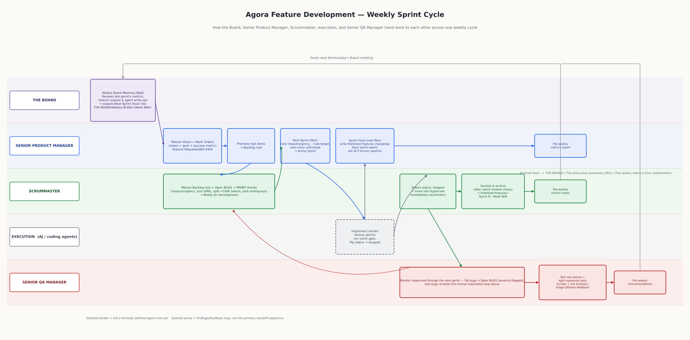
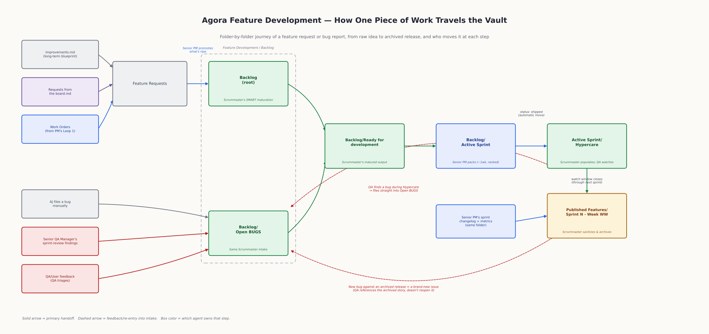

# Agentic Scrum Pipeline — Overview

> A living description of the AI-agent Scrum pipeline governing Agora's
> development, as currently designed. Source of truth for each role's exact
> behavior is its own prompt in `Feature Development/Project Team/`; this
> page is the map that ties them together. Update it whenever a role prompt
> changes in a way that affects the flow below.

## The cast

Three roles are built and live in `Feature Development/Project Team/`:

- **[[Scrummaster]]** — owns intake and maturation. Turns raw feature
  requests and bug reports into SMART, self-contained stories a coding
  agent can execute. Also owns the full Hypercare lifecycle (populate,
  monitor-adjacent, sanitize, archive) and the numbering/archiving hygiene
  of the whole Backlog.
- **[[Senior Product Manager]]** — owns the connection between the Board's
  high-level direction and the week-to-week sprint. Matures the Board's
  vision into work orders, promotes them into the Backlog, packs and closes
  sprints, reports to AJ on Slack.
- **[[Senior QA Manager]]** — tests what shipped, watches Hypercare, files
  what it finds, and is the qualitative/strategic voice in front of the
  Board — vision alignment, blind spots, "next level" ideas.

A fourth role is referenced throughout but **not yet built**: **THE BOARD**,
a weekly governance meeting (see `THE BOARD/readme.md.md`) that reviews the
prior sprint and produces the next one's high-level vision, and — longer
term — has the mandate to revise or add/remove agent prompts, subject to
AJ's approval. Everywhere this page says "the Board," that's a process
AJ currently stands in for until the role exists.

Execution itself — actually writing code against a packed story — isn't a
defined agent role either. It's AJ and/or coding agents working directly
against `Backlog/Active Sprint`. All three built roles treat it as an
external step whose only observable signal is a story's `status` field
flipping to `shipped`.

## The weekly cycle, at a glance

Read left to right, one lane per role. The short version:

1. **Wednesday** — the Board reviews last sprint's metrics, shipped
   features, and every active agent's friction writeup, and produces a
   next-sprint vision document.
2. The **Senior PM** matures that vision into work orders (vision + goal +
   success metric — no acceptance criteria yet) and promotes the ripe ones
   into `Backlog` root, right alongside anything else already sitting there
   (raw feature requests, board asks, bugs from any source).
3. The **Scrummaster** continuously matures whatever's in `Backlog` root
   and `Open BUGS` into SMART stories in `Ready for development` —
   scoping, sizing, splitting oversized work, parking what's genuinely
   ambiguous.
4. **Monday** — the **Senior PM** packs `Active Sprint` from `Ready for
   development`, ranked by impact/urgency, sized to roughly one week,
   auto-carrying anything unfinished from the previous sprint first.
5. Execution happens. When a story goes live, its `status` flips to
   `shipped`.
6. The **Scrummaster** notices the flip and immediately moves the story
   into **Hypercare** — a post-ship watch lane it owns, spanning the
   release and the entirety of the following sprint. The **Senior QA
   Manager** monitors everything sitting there and files anything it finds
   straight into `Open BUGS`.
7. When the following sprint closes, the **Scrummaster** sanitizes
   Hypercare and archives the story into `Published features/Sprint N -
   Week WW` — the same folder the **Senior PM**'s narrative changelog for
   that sprint lands in.
8. The **Senior QA Manager** tests what shipped this sprint plus a light
   regression pass, and — along with the **Senior PM** and **Scrummaster**
   — files a weekly writeup into `THE BOARD`'s stakeholders folder, which
   feeds the following Wednesday's meeting. The loop closes.

## How a single piece of work actually moves through the vault

The cycle above is the *time* view — who does what, when. This is the
*artifact* view: where a single feature request or bug report physically
lives at each stage, and who moves it.

A few things worth calling out that aren't obvious from the folder names
alone:

- **`Backlog` root and `Open BUGS` are two intake doors into the same
  maturation process.** The Scrummaster doesn't care which door something
  came through, or who opened it — arrival is promotion.
- **The Hypercare feedback loop is deliberate.** A bug found while
  something's still in its watch window re-enters `Open BUGS` exactly like
  any other bug — there's no separate "hotfix" path. What's different is
  *urgency*: the Senior QA Manager flags anything serious with
  `severity_hint: escalate` so it doesn't sit in line behind routine work.
- **Once archived, a story is a closed chapter.** A bug against an
  already-published release isn't reopened — it's a brand-new issue that
  happens to reference the archived original for context.

## Governance: how the Board actually steers the project

The Board doesn't write code or backlog items directly — its only lever is
the **next-sprint vision document** it produces each Wednesday, which the
Senior PM is responsible for turning into concrete work orders. Everything
the Board knows going into that meeting comes from three weekly writeups,
all filed to `THE BOARD/The Executive assistants office/This weeks metrics
from stakeholders`:

| From | Content |
|---|---|
| Senior Product Manager | Formal throughput/quality/agent-friction metrics |
| Senior QA Manager | Vision alignment, blind spots, "next level" recommendations |
| Scrummaster | Backlog-maturation friction — parked/split counts, upstream/downstream handoff quality |

Per `THE BOARD/readme.md`, the Board's own longer-term mandate extends
beyond just setting vision: it can propose revising, adding, or removing
agent prompts in a project's Team folder to improve productivity and
quality — always subject to AJ's approval as CEO. That mechanism isn't
built yet; today, AJ plays the Board's role by hand.

## What's still open

- **THE BOARD role itself** — not yet built as a prompt/process.
- **The Board's vision-doc location** — `THE BOARD/Weekly Briefs/<Week
  WW>` is a placeholder convention the Senior PM prompt already tolerates
  being empty; nothing is written there yet.
- **Hermes Agent wiring** — each of the three prompts above will run as a
  configurable skill inside Hermes Agent, which owns the actual scheduling/
  trigger-monitoring loop and already has Slack access. How that config is
  shaped (and whether it changes anything about file-based state) hasn't
  been walked through yet.
- **Execution isn't a defined role** — AJ and/or coding agents work
  directly against `Active Sprint`; nothing here formalizes that step.

## Related

- [[Agentic Chatroom]] — current project status snapshot
- [[improvements]] — long-term product blueprint (feeds Feature Requests)
- [[NOTES]] — running technical session log
- `Feature Development/Project Team/Scrummaster.md`
- `Feature Development/Project Team/Senior Product Manager.md`
- `Feature Development/Project Team/Senior QA Manager.md`
- `THE BOARD/readme.md.md`
